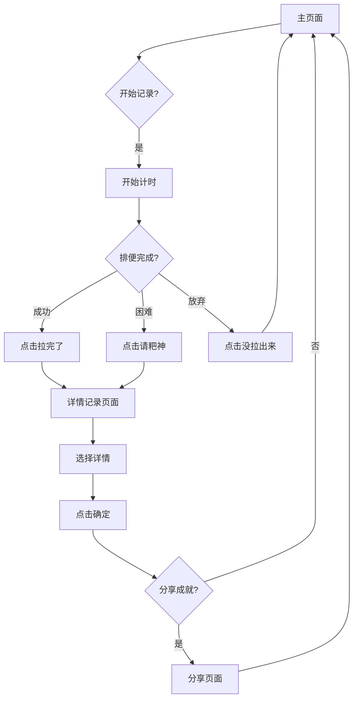

## 1. 产品概述

一款趣味性的健康记录小程序，帮助用户记录和追踪排便情况。通过可爱的卡通界面和计时功能，让用户轻松记录每次排便的详细信息和健康状况。

* 目标用户：关注健康、希望记录排便习惯的用户群体

* 产品价值：提供便捷的排便记录工具，帮助用户了解自己的消化健康状况

## 2. 核心功能

### 2.1 用户角色

| 角色   | 注册方式   | 核心权限           |
| ---- | ------ | -------------- |
| 普通用户 | 微信授权登录 | 记录排便、查看统计、分享成果 |

### 2.2 功能模块

我们的拉粑粑记录小程序包含以下主要页面：

1. **主页面**：计时功能、开始记录、完成记录、请粑神功能
2. **详情记录页面**：颜色选择、状态选择、形状选择、把量选择
3. **统计页面**：排便记录统计、健康趋势分析
4. **我的页面**：个人信息、设置、历史记录
5. **分享页面**：成果分享、趣味文案

### 2.3 页面详情

| 页面名称   | 模块名称   | 功能描述                             |
| ------ | ------ | -------------------------------- |
| 主页面    | 计时显示   | 显示当前排便计时，格式为"X分钟X秒"，实时更新         |
| 主页面    | 开始记录   | 点击"我要拉了哦"按钮开始计时，切换至记录状态          |
| 主页面    | 完成记录   | 显示"拉完了"和"请粑神"双按钮，分别对应成功和困难情况     |
| 主页面    | 放弃记录   | 提供"尽力了，没拉出来"选项，可结束当前计时           |
| 主页面    | 上次记录提示 | 显示"距离上次拉粑粑已经是X小时X分钟之前了"          |
| 详情记录页面 | 颜色选择   | 提供黄褐色、棕色、黑色、绿色、红色、灰白色6种选项，单选     |
| 详情记录页面 | 状态选择   | 提供正常、便秘、拉肚子3种状态，单选               |
| 详情记录页面 | 形状选择   | 提供香蕉、颗粒、软糊糊、裂块条纹、水样便便5种形状，单选     |
| 详情记录页面 | 把量选择   | 提供非常少、少量、适中、大量4个等级，单选            |
| 详情记录页面 | 确认保存   | 点击"确定"按钮保存详细记录                   |
| 统计页面   | 记录列表   | 显示历史排便记录，包含时间、时长、详情等信息           |
| 统计页面   | 趋势图表   | 展示排便频率、时长等数据的图表分析                |
| 我的页面   | 个人信息   | 显示用户头像、昵称等基本信息                   |
| 我的页面   | 历史统计   | 显示总记录次数、平均时长等统计数据                |
| 分享页面   | 成就展示   | 显示趣味文案和评分，如"今天我为大自然献出了100分的粑粑养料" |
| 分享页面   | 分享按钮   | 提供分享至朋友圈或保存图片功能                  |
| 底部导航   | 打卡标签   | 主页面入口，显示为选中状态                    |
| 底部导航   | 统计标签   | 统计页面入口                           |
| 底部导航   | 我的标签   | 个人中心入口                           |

## 3. 核心流程

### 用户记录流程

1. 用户进入主页面，查看上次记录时间提示
2. 点击"我要拉了哦"开始计时
3. 系统进行实时计时显示
4. 用户完成排便后选择"拉完了"或"请粑神"
5. 系统弹出详情记录页面
6. 用户选择颜色、状态、形状、把量等信息
7. 点击"确定"保存完整记录
8. 可选择分享成就或返回主页面

### 放弃记录流程

1. 在计时过程中，用户可点击"尽力了，没拉出来"
2. 系统询问是否确认放弃
3. 确认后清除当前计时，返回初始状态

## 4. 用户界面设计

### 4.1 设计风格

* **主色调**：绿色系（#8BCE92, #6ecb6d）和橙黄色系（#ffb60d）

* **辅助色**：粉色系用于选中状态和按钮

* **字体风格**：圆润、粗体、易读的无衬线字体

* **按钮样式**：圆角矩形，带有装饰性边框

* **图标风格**：卡通化、可爱的emoji风格

* **整体布局**：卡片式布局，圆角设计，柔和阴影

### 4.2 页面设计概述

| 页面名称   | 模块名称 | UI元素                            |
| ------ | ---- | ------------------------------- |
| 主页面    | 标题区域 | "粑粑简史"大标题，白色填充+绿色粗描边，左上角有黄色小花装饰 |
| 主页面    | 计时显示 | 橙色文字，中等大小，居中显示在标题下方             |
| 主页面    | 操作按钮 | 绿色背景+黄色装饰边框，圆角矩形，大字体深色文字        |
| 主页面    | 底部导航 | 三个标签页，绿色表示选中，灰色表示未选中            |
| 详情记录页面 | 选项卡片 | 粉色圆角卡片表示选中，白色卡片表示未选中            |
| 详情记录页面 | 按钮文字 | 绿色文字表示可选，白色文字表示已选中              |
| 分享页面   | 成就弹窗 | 绿色背景，白色文字，黄色高亮显示分数              |
| 分享页面   | 分享按钮 | 粉色圆角按钮，白色文字                     |

### 4.3 响应式设计

* **移动端优先**：针对微信小程序移动端优化

* **适配方案**：使用rpx单位进行响应式布局

* **交互优化**：触摸友好的按钮大小和间距

* **视觉反馈**：点击态、加载态等交互反馈

