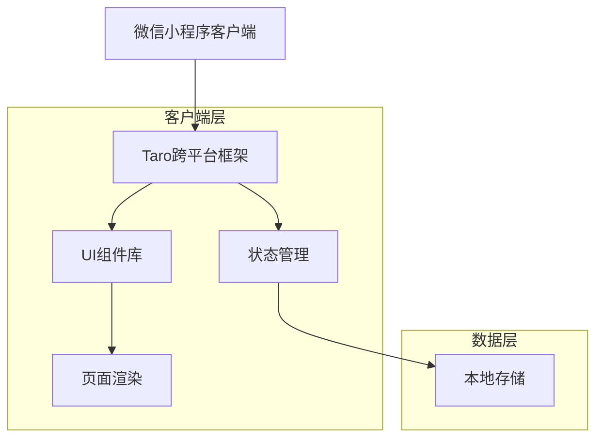
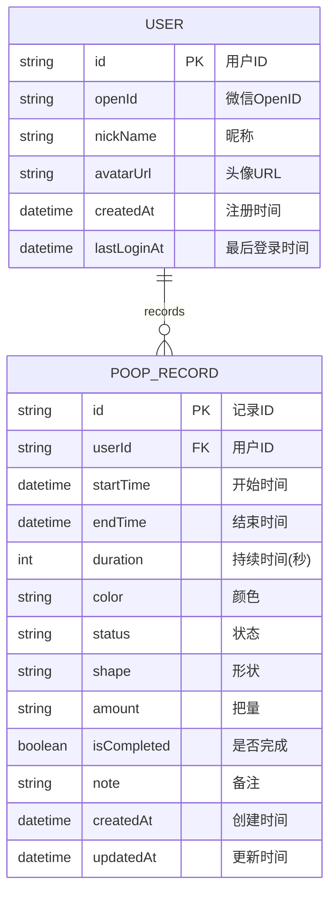

## 1. 架构设计



## 2. 技术描述

- **前端框架**: Taro@3 + Vue3 + TypeScript
- **UI组件库**: NutUI
- **初始化工具**: taro-init
- **状态管理**: Pinia
- **后端服务**: 微信小程序云开发
- **数据库**: 微信小程序云数据库

## 3. 路由定义

| 路由 | 页面名称 | 用途 |
|------|----------|------|
| /pages/index/index | 主页面 | 计时功能和记录入口 |
| /pages/statistics/index | 统计页面 | 显示排便记录统计 |
| /pages/profile/index | 我的页面 | 个人信息和设置 |
| /pages/share/index | 分享页面 | 成就分享功能 |

## 4. 数据模型定义

### 4.1 排便记录实体


### 4.2 数据库表结构

#### 用户表 (users)
```sql
{
  "_id": "string",
  "openId": "string",
  "nickName": "string",
  "avatarUrl": "string",
  "createdAt": "Date",
  "lastLoginAt": "Date"
}
```

#### 排便记录表 (poop_records)
```sql
{
  "_id": "string",
  "userId": "string",
  "startTime": "Date",
  "endTime": "Date",
  "duration": "number",
  "color": "string",
  "status": "string",
  "shape": "string",
  "amount": "string",
  "isCompleted": "boolean",
  "note": "string",
  "createdAt": "Date",
  "updatedAt": "Date"
}
```

## 5. 核心组件设计

### 5.1 状态管理 (Pinia Store)
```typescript
// store/poop.ts
export const usePoopStore = defineStore('poop', {
  state: () => ({
    currentRecord: null,
    isRecording: false,
    startTime: null,
    elapsedTime: 0,
    records: []
  }),
  
  actions: {
    startRecording() {
      this.isRecording = true
      this.startTime = new Date()
      this.startTimer()
    },
    
    stopRecording() {
      this.isRecording = false
      this.elapsedTime = 0
    },
    
    saveRecord(details: PoopDetails) {
      const record = {
        startTime: this.startTime,
        endTime: new Date(),
        duration: this.elapsedTime,
        ...details
      }
      // 保存到数据库
      this.records.push(record)
    }
  }
})
```

### 5.2 详情记录组件
```typescript
interface PoopDetails {
  color: string // 黄褐色 | 棕色 | 黑色 | 绿色 | 红色 | 灰白
  status: string // 正常 | 便秘 | 拉肚子
  shape: string // 香蕉 | 颗粒 | 软糊糊 | 裂块条纹 | 水样便便
  amount: string // 非常少 | 少量 | 适中 | 大量
}
```

## 6. 微信小程序云开发配置

### 6.1 云函数设计
- **getUserRecords**: 获取用户排便记录
- **saveRecord**: 保存排便记录
- **getStatistics**: 获取统计数据
- **shareAchievement**: 生成分享内容

### 6.2 数据库索引
```javascript
// 为用户ID创建索引
db.collection('poop_records').createIndex({
  userId: 1,
  startTime: -1
})

// 为创建时间创建索引
db.collection('poop_records').createIndex({
  createdAt: -1
})
```

## 7. 本地存储方案

### 7.1 本地缓存结构
```typescript
interface LocalCache {
  currentRecord?: {
    startTime: number
    isCompleted: boolean
  }
  lastRecordTime?: number
  settings: {
    enableNotification: boolean
    theme: 'light' | 'dark'
  }
}
```

### 7.2 数据同步策略
- 优先使用本地缓存提升响应速度
- 网络可用时自动同步到云端
- 提供手动刷新和备份功能

## 8. 性能优化

### 8.1 页面加载优化
- 使用分包加载减少首次加载时间
- 图片资源使用CDN加速
- 组件懒加载提升渲染性能

### 8.2 数据查询优化
- 分页加载历史记录
- 使用数据库索引提升查询效率
- 本地缓存常用数据减少网络请求